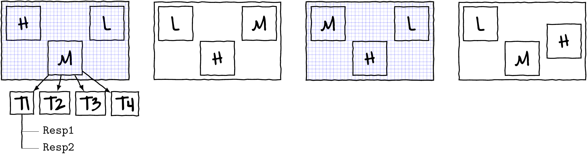

```{r}
#| label: setup
#| include: false
#| cache: false

knitr::opts_chunk$set(cache.lazy = FALSE,
                      tidy = "styler")
options(tinytex.engine = "xelatex")
```


# Preparations

Load the necessary libraries

```{r}
#| label: libraries
#| results: markup
#| eval: true
#| echo: true
#| cache: false
#| message: false
#| warning: false
library(tidyverse) #for data wrangling
```

## Data files

```{r}
#| label: getData
#| results: markup
#| eval: true
#| echo: true
#| cache: false
load(file='../data/manipulationDatasets.RData')
```

`dat.1`

{width=70%}

### Exploring data

```{r}
#| label: getData1
#| results: markup
#| eval: true
#| echo: true
#| cache: false
dat.1 |> head()
```

```{r}
#| label: exploringdata
#| results: markup
#| eval: true
#| echo: true
#| cache: false
## replace this with code to explore imported data
## From now on I will not provide many code chunks.
## Instead you are incouraged to create your own chunks
## with discussed code
## In Rstudio, you can create a chunk with Cntr-Alt-I
```

## Overview of functions

### Operating on a single dataset

**operating on the rows**

| Function             | Action                                   |
|----------------------|------------------------------------------|
| `dplyr::arrange()`   | changing the order of rows               |
| `dplyr::filter()`    | subset of rows based on column values    |
| `dplyr::slice()`     | subset of rows based on position         |
| `dplyr::summarise()` | aggregating (collapsing) to a single row |
| `dplyr::count()`     | count the number of unique combinations  |
| `dplyr::group_by()`  | define groups of rows                    |

**operating on the columns**

| Function             | Action                                           |
|----------------------|--------------------------------------------------|
| `dplyr::select()`    | subset of columns                                |
| `dplyr::rename()`    | change the name of columns                       |
| `dplyr::pull()`      | extract a single column as a vector              |
| `dplyr::distinct()`  | unique combinations of column values             |
| `dplyr::mutate()`    | adding columns and modifying column values       |
| `tidyr::unite()`     | combine multiple columns together                |
| `tidyr::separate()`  | separating a single column into multiple columns |

**reshaping (pivotting) the dataset**

| Function                | Action                         |
|-------------------------|--------------------------------|
| `tidyr::pivot_longer()` | lengthen data from wide format |
| `tidyr::pivot_wider()`  | widen data from long format    |

### Operating on two datasets

| Function          | Action                                                    |
|-------------------|-----------------------------------------------------------|
| `dplyr::*_join()` | merge (join) two datasets together based on common fields |

# Piping

```{r}
#| label: piping
#| results: markup
#| eval: true
#| echo: true
#| cache: false
head(dat.1)
#OR
dat.1 |> head()
```

# Data frames and tibbles

# Base R data manipulation

# Tidyverse data manipulation

Link to the data transformation cheatsheet

https://github.com/rstudio/cheatsheets/raw/master/data-transformation.pdf


- Operating on a single dataset
  - operating on the rows

| Function           | Action                                |
|--------------------|---------------------------------------|
| `dplyr::arrange()` | changing the order of rows            |
| `dplyr::filter()`  | subset of rows based on column values |
| `dplyr::slice()`   | subset of rows based on position      |

  - operating on the columns

| Function             | Action                                           |
|----------------------|--------------------------------------------------|
| `dplyr::select()`    | subset of columns                                |
| `dplyr::rename()`    | change the name of columns                       |
| `dplyr::pull()`      | extract a single column as a vector              |
| `dplyr::distinct()`  | unique combinations of column values             |
| `dplyr::mutate()`    | adding columns and modifying column values       |
| `tidyr::unite()`     | combine multiple columns together                |
| `tidyr::separate()`  | separating a single column into multiple columns |

  - operating on the rows

| Function             | Action                                   |
|----------------------|------------------------------------------|
| `dplyr::summarise()` | aggregating (collapsing) to a single row |
| `dplyr::count()`     | count the number of unique combinations  |
| `dplyr::group_by()`  | define groups of rows                    |

  - reshaping (pivotting) the dataset

| Function                | Action                         |
|-------------------------|--------------------------------|
| `tidyr::pivot_longer()` | lengthen data from wide format |
| `tidyr::pivot_wider()`  | widen data from long format    |

- Operating on two datasets

| Function          | Action                                                    |
|-------------------|-----------------------------------------------------------|
| `dplyr::*_join()` | merge (join) two datasets together based on common fields |


## Tidy evaluation

- **data-masking** - refer to variables directly
    - e.g. `arrange(dat.1, Resp1)`
    - applies to:
         - `arrange()`
         - `filter()`
         - `count()`
         - `mutate()`
         - `summarise()`
         - `group_by()`
- **tidy-selection** - refer to variables by position, name or type
    - e.g. `select(dat.1, starts_with("Resp"))`
    - applies to:
         - `select()`
         - `rename()`
         - `pull()`
         - `across()`

## Summary and vectorized functions

- **Summary functions**
  - take a vector and return a **single value**
     - e.g. `mean()`

- **Vectorized functions**
  - take a vector and return a **vector**
     - e.g. `log()`

# Sorting data

# Subsets of data

## Subset columns (select)

### Helper functions

#### Regular expressions (regex)

https://github.com/rstudio/cheatsheets/raw/master/data-transformation.pdf

## Extracting a single variable

## Renaming columns -rename


## Subset of rows (filter)

## Selecting rows by number - slice

# Adding/editing columns - mutate

## Using helper functions

# Summarising (aggregating) data

# Grouping

# Reshaping data

## Pivot longer

## Pivot wider

# Combining data

# Applied examples
