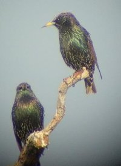

```{r}
#| label: setup
#| include: false
#| cache: false

knitr::opts_chunk$set(cache.lazy = FALSE,
                      tidy = "styler")
options(tinytex.engine = "xelatex")
```

# Preparations

Load the necessary libraries

```{r}
#| label: libraries
#| output: false
#| eval: true
#| warning: false
#| message: false
#| cache: false

library(tidyverse)  #for data wrangling etc
library(cmdstanr)   #for cmdstan
library(brms)       #for fitting models in STAN
library(standist)   #for exploring distributions
library(HDInterval) #for HPD intervals
library(posterior)  #for posterior draws
library(coda)       #for diagnostics
library(bayesplot)  #for diagnostics
library(rstan)      #for interfacing with STAN
library(emmeans)    #for marginal means etc
library(broom)      #for tidying outputs
library(DHARMa)     #for residual diagnostics
library(tidybayes)  #for more tidying outputs
library(ggeffects)  #for partial plots
library(broom.mixed)#for tidying MCMC outputs
library(patchwork)  #for multiple plots
library(ggridges)   #for ridge plots 
library(bayestestR) #for ROPE
library(easystats)     #framework for stats, modelling and visualisation
source('helperFunctions.R')
```

# Scenario

{#fig-starlings width="200" height="274"}


SITUATION   MONTH   MASS   BIRD
----------- ------- ------ -----------
tree        Nov     78     tree1
..          ..      ..     ..
nest-box    Nov     78     nest-box1
..          ..      ..     ..
inside      Nov     79     inside1
..          ..      ..     ..
other       Nov     77     other1
..          ..      ..     ..
tree        Jan     85     tree1
..          ..      ..     ..

: Format of starling_full.csv data file {#tbl-starling .table-condensed}

--------------- ------------------------------------------------------------------------------
**SITUATION**   Categorical listing of roosting situations (tree, nest-box, inside or other)
**MONTH**       Categorical listing of the month of sampling.
**MASS**        Mass (g) of starlings.
**BIRD**        Categorical listing of individual bird repeatedly sampled.
--------------- ------------------------------------------------------------------------------

: Description of the variables in the starling_full data file {#tbl-starling1 .table-condensed}

# Read in the data

```{r readData, results='markdown', eval=TRUE}
starling <- read_csv('../data/starling_full.csv', trim_ws = TRUE)
```


# Exploratory data analysis

::: {.columns}
:::: {.column width="50%"}
Random intercepts model formula:
$$
\begin{align}
y_i &\sim{} \mathcal{N}(\mu_i, \sigma^2)\\
\mu_i &= \beta_0 + \boldsymbol{\beta} \bf{X_i} + \boldsymbol{\gamma} \bf{Z_i}\\
\boldsymbol{\gamma} &= \gamma_0\\
\beta_0 &\sim{} \mathcal{N}(80, 2.5)\\
\beta &\sim{} \mathcal{N}(0, 10)\\
\gamma_0 &\sim{} \mathcal{N}(0, \sigma_1^2)\\
\sigma &\sim{} \mathcal{t}(3, 0, 6)\\
\sigma_1 &\sim{} \mathcal{t}(3, 0, 6)\\
\end{align}
$$
::::
:::: {.column width="50%"}

Random intercept/slope model formula:
$$
\begin{align}
y_{i,j} &\sim{} \mathcal{N}(\mu_{i,j}, \sigma^2)\\
\mu_{i,j} &=\beta_0 + \bf{Z_j}\boldsymbol{\gamma_j} + \bf{X_i}\boldsymbol{\beta} \\
\beta_0 &\sim{} \mathcal{N}(80, 2)\\
\beta_1 &\sim{} \mathcal{N}(0, 10)\\
\boldsymbol{\gamma_j} &\sim{} \mathcal{N}(0, \boldsymbol{\Sigma})\\
\boldsymbol{\Sigma} &= \boldsymbol{D}({\sigma_l})\boldsymbol{\Omega}\boldsymbol{D}({\sigma_l^2})\\
\boldsymbol{\Omega} &\sim{} LKJ(\zeta)\\
\sigma_l^2 &\sim{} \mathcal{t}(3,0,3)\\
\sigma^2 &\sim{} \mathcal{t}(3, 0, 3)\
\end{align}
$$
::::
:::


- $\bf{X}$ is the model matrix representing the effects of the situation and month on the mass of birds.
- $\boldsymbol{\beta}$ is a vector of the population-level effects
  parameters to be estimated.
- $\boldsymbol{\gamma}$ is a vector of the group-level effect parameters
- $\bf{Z}$ represents a cell means model matrix for the random intercepts (and
  possibly random slopes) associated with indivual birds.
- the population-level intercept ($\beta_0$) has a gaussian prior with location
  of 80 and scale of 2.5
- the population-level effect ($\beta_1$) has a gaussian prior with location of
  0 and scale of 10
- the group-level effects are assumed to sum-to-zero and be drawn from a
  gaussian distribution with mean of 0 and covariance of $\Sigma$  
- $\boldsymbol{\Sigma}$ is the variance-covariance matrix between the
  groups (individual leaves).  It turns out that it is difficult to
  apply a prior on this covariance matrix, so instead, the covariance
  matrix is decomposed into a correlation matrix
  ($\boldsymbol{\Omega}$) and a vector of variances
  ($\boldsymbol{\sigma_l^2}$) which are the diagonals ($\boldsymbol{D}$)
  of the covariance matrix.
- $\boldsymbol{\Omega}$ 

$$
\begin{align}
\gamma &\sim{} N(0,\Sigma)\\
\Sigma &-> \Omega, \tau\\
\end{align}
$$

where $\Sigma$ is a covariance matrix.


# Fit the model

::: {.panel-tabset}

:::
    
# MCMC sampling diagnostics

::: {.panel-tabset}


:::


# Model validation 

::: {.panel-tabset}

:::
    


# Partial effects plots 

::: {.panel-tabset}

:::
    

# Model investigation 

::: {.panel-tabset}

:::

# Further investigations 

::: {.panel-tabset}

