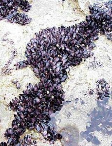

```{r setup, include=FALSE, warnings=FALSE, message=FALSE}
knitr::opts_chunk$set(echo = TRUE)
```

# Preparations

Load the necessary libraries

```{r}
#| label: libraries
#| output: false
#| eval: true
#| warning: false
#| message: false
#| cache: false

library(glmmTMB)       #for model fitting
library(car)           #for regression diagnostics
library(broom)         #for tidy output
library(ggfortify)     #for model diagnostics
library(DHARMa)        #for residual diagnostics
library(see)           #for plotting residuals
library(knitr)         #for kable
library(effects)       #for partial effects plots
library(ggeffects)     #for partial effects plots
library(emmeans)       #for estimating marginal means
library(modelr)        #for auxillary modelling functions
library(tidyverse)     #for data wrangling
library(lindia)        #for diagnostics of lm and glm
library(performance)   #for residuals diagnostics
library(sjPlot)        #for outputs
library(report)        #for reporting methods/results
library(easystats)     #framework for stats, modelling and visualisation
library(MASS)          #for negative binomials
library(MuMIn)         #for AICc
```

# Scenario

Here is a modified example from @Peake-1993-269.  @Peake-1993-269 investigated
the relationship between the number of individuals of invertebrates living in
amongst clumps of mussels on a rocky intertidal shore and the area of those
mussel clumps.

{#fig-musseles}

:::: {.columns}
::: {.column width="30%"}

| AREA      | INDIV   |
| --------- | ------- |
| 516.00    | 18      |
| 469.06    | 60      |
| 462.25    | 57      |
| 938.60    | 100     |
| 1357.15   | 48      |
| \...      | \...    |

: Format of peakquinn.csv data files {#tbl-mussels .table-condenses}

:::
::: {.column width="70%"}

----------- --------------------------------------------------------------
**AREA**    Area of mussel clump mm^2^ - Predictor variable
**INDIV**   Number of individuals found within clump - Response variable
----------- --------------------------------------------------------------

: Description of the variables in the peake data file {#tbl-peake1 .table-condensed}

:::
::::


The aim of the analysis is to investigate the relationship between mussel clump
area and the number of non-mussel invertebrate individuals supported in the
mussel clump.

# Read in the data

```{r}
#| label: readData
#| output: true
#| eval: true
peake <- read_csv("../data/peakquinn.csv", trim_ws = TRUE)
```

# Exploratory data analysis

Model formula:
$$
y_i \sim{} \mathcal{Pois}(\lambda_i)\\
ln(\lambda_i) = \beta_0 + \beta_1 ln(x_i)
$$

where the number of individuals in the $i^th$ observation is assumed to be drawn
from a Poisson distribution with a $\lambda$ (=mean) of $\lambda_i$.  The
natural log of these expected values is modelled against a linear predictor that
includes an intercept ($\beta_0$) and slope ($\beta_i$) for natural log
transformed area.  expected values are


# Fit the model


# Model investigation / hypothesis testing 

# Predictions 

# Summary figures

# References
